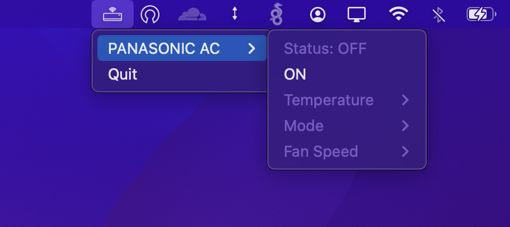

<h2 align="center">
   
  
   
  MirAIe
   
</h2>

<h4 align="center">Panasonic MirAIe Device Controls from Desktop System Tray Menu</h4>

## Screenshot

## Supported Devices

- AC

## Features

- Power On/Off
- Set Temperature
- Switch AC Modes (eg. Auto, Dry, Fan)
- Control Fan Speed

## Install

`go get github.com/iMro0t/go-miraie`

## Run

`miraie --username user@example.com --password supersecret`
